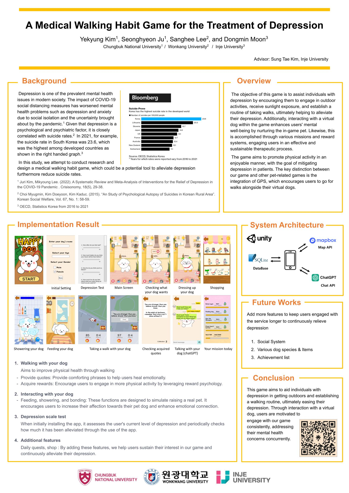

# HappyDog
***ICCAS 2023*** - SW중심대학사업단 해외교육 프로그램   
#### 주제
지능형 디지털 치료제(digital therapeutics)를 위한 의료용 기능성 게임 개발   
#### 일정
- 국내 1차 사전(캠프)교육 : 2023.04.08(토) ~ 04.09.(일) 
- 국내 2차 사전교육 : 2023.07.26.(수) ~ 2023.08.04.(금) 2주 몰입교육 (충북대학교)
- 독일 현장교육 : 2023.08.13(일) ~ 08.20(일) 1주 (독일 뮌헨,  Science congress center Munich)    

  

## EKC 2023 Abstract
### Title
A Medical Walking Habit Game for the Treatment of Depression
### Content
Depression is one of the prevalent mental health issues in modern society, causing patients to experience an increasing loss of interest and motivation in everyday activities. The impact of COVID-19 social distancing measures has worsened mental health problems such as depression and anxiety due to social isolation and the uncertainty brought about by the pandemic [1]. Currently, South Korea has maintained the highest suicide rate among OECD countries for over a decade [2]. Given that depression is a psychological and psychiatric factor, it is closely correlated with suicide rates [3]. Therefore, we are conducting research and designing a medical walking habit game that could potentially serve as a solution to this problem. 

The objective of this game is to assist patients with depression in going outdoors, getting exposure to sunlight, and forming a habit of taking walks, ultimately alleviating their depression [4]. Additionally, interacting with a virtual dog in the game helps improve users' mental well-being by nurturing the pet within the game [5]. Through various missions and reward systems, users engage in an effective and sustainable therapeutic process. Ultimately, the game aims to promote physical activity in an enjoyable way, with the goal of alleviating depression in patients.

During the initial game setup or when the virtual dog reaches certain levels, regular depression scale assessments are conducted to monitor the level of depression. The dog-walking feature encourages outdoor physical activity by providing real-time GPS information to track the user's actual distance and time of movement. Users are rewarded with in-game experience points and virtual currency based on the distance and time they spend walking with their virtual dogs. Whenever the user reaches specific locations marked on the map while walking their virtual dog, they receive random comforting messages as collectible items. Moreover, there are several other interactive features with the virtual dog, such as the ability to chat with the virtual pet using ChatGPT, feed the dog, give it a bath, and show affection. This way, the game is expected to play an effective role as a supportive tool for maintaining the mental health of patients with depression, aiding them in overcoming social isolation and depression.

### Authors
[문동민](https://github.com/qqansqq)(인제대학교, 팀장)  
[김예경](https://github.com/vss121)(충북대학교)  
[이상희](https://github.com/sanghee01)(원광대학교)  
[주성현](https://github.com/Gosomik)(충북대학교)   

### Track
Poster

### Keywords
depressive disorder, digital therapeutics, artificial intelligence, chatgpt, virtual dog

### References
[1] Juri Kim, Mikyoung Lee. (2022). A Systematic Review and Meta-Analysis of Interventions for the Relief of Depression in the COVID-19 Pandemic . Crisisonomy, 18(5), 29-38.  
[2] Kim, J., Park, sang-mahn and Kim, gang-hoon (2017) “A Study of Causal Loop Analysis for Suicide Protection of Korean Society: focusing on the adolescent,” Korean System Dynamics Review. Korean System Dynamics Society.  
[3] Choi Myugmin, Kim Doeyoon, Kim Kaduc. (2015). “An Study of Psychological Autopsy of Suicides in Korean Rural Area”. Korean Social Welfare, Vol. 67, No. 1: 58-59.   
[4] Heo, Jeong Sun. (2019) "Effect and Mechanism Verification of Behavioral Activation Therapy for Depression." Doctoral dissertation, Graduate School of Chung-Ang University, Seoul, 13, 34.  
[5] Seo, Soo Yeon. (2023), "User Study for the Design and Development of Senior-targeted Pet Rearing Simulation," Research Professor, Inje University 4th Stage BK21 Healthcare 4C Design Education & Research Group. 7  

## 

